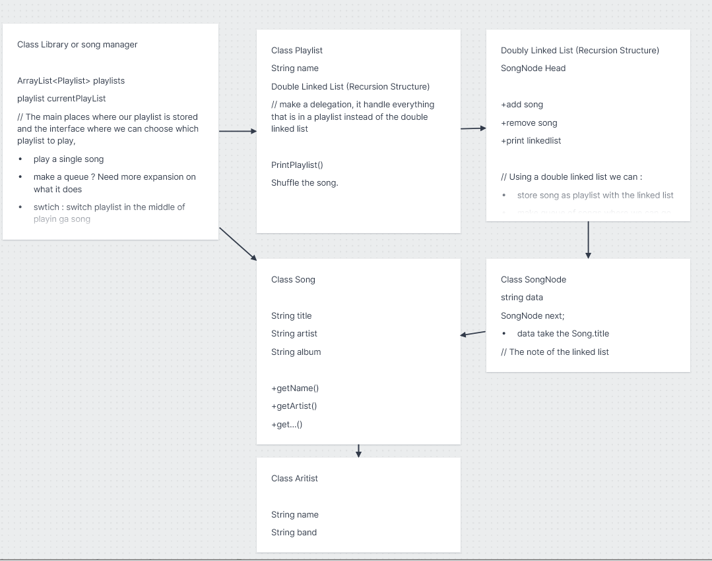

### TOPIC 2: Music Library Management

#### Problem statement:
---
In the problem, there are songs by artists (artists can be bands or solo artists), and these songs can be singles or belong to albums. You are required to create song ca
talogues or libraries or playlists with ability to go to the previous song or the next song, as well as shuffle play.

--- 

**Song Class**

Purpose: Represents an individual song in the music library.

**SongNode Class**

Purpose: Serves as a node in the doubly linked list, holding a Song object and references to the next and previous nodes.

**DoublyLinkedList Class**

Purpose: Manages a list of SongNode objects, allowing navigation through songs.

**Playlist Class**

Purpose: Represents a playlist containing a collection of songs. Also made up of the doublelinkedlist

**SongManager Class**

Purpose: Acts as the central controller for user interactions, managing playlists, songs, and the temporary queue.

Overall Flow of the application the user can: 
1. Starting the Application: Initialized the system with a predefine song and playlist and started the interaction loop
2. Use Command: create, play, show, exit
3. displaying information: show song playlist and song
4. creating playlist: 
5. adding song to playlist 
6. playing song
7. navigating song
8. shuffle song 
9. Exist application

Responsiblities: 
Vathana Khun: plan out the class structure and overall structure on how the program should work

## Image of the class structure
